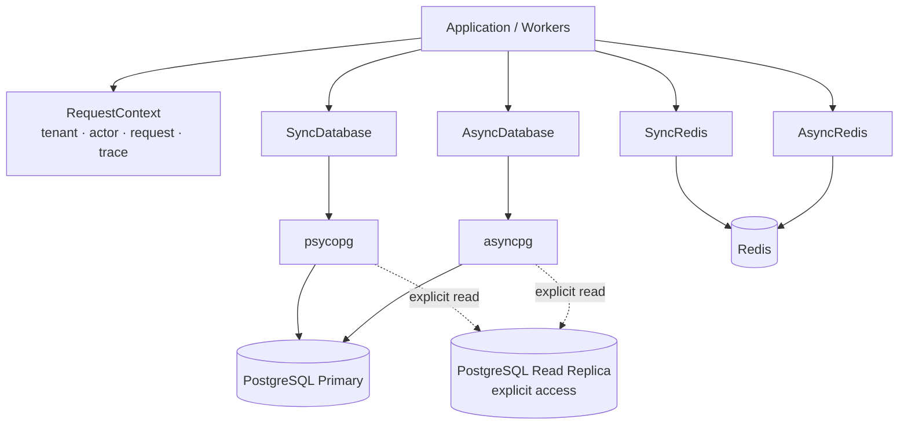

# Architecture

## Principles

1. **PostgreSQL is the system of record.** Redis accelerates, coordinates, and buffers; it does not own authoritative SaaS business state.
2. **Transactions are explicit.** Session creation, transaction begin, commit, rollback, and disposal are visible in application code.
3. **Sync and async have equal capabilities.** Both runtimes use the same metadata, models, migration history, context, and operational semantics.
4. **Replica use is explicit.** Callers select a read session or read-only transaction. A normal transaction always uses the primary.
5. **Tenant isolation is defense in depth.** Application filters are useful, but PostgreSQL RLS can enforce the boundary at the database layer.
6. **Cross-system delivery is at least once.** Domain writes and outbox enqueue are atomic; external publication must be idempotent.
7. **No hidden global clients.** Runtime objects own connection pools and provide deterministic shutdown.

## Components



## Database runtime

Each runtime creates:

- one primary engine;
- an optional replica engine;
- a write session factory;
- a read session factory.

The pool is bounded by `pool_size + max_overflow`. Size every process independently. For example, 12 web processes with a pool of 10 and overflow of 20 can create up to 360 connections, before workers, migrations, observability, or administrative clients are counted.

## Transaction semantics

- `session()` only owns lifecycle; it does not commit automatically.
- `transaction()` begins and commits on success and rolls back on failure.
- `read_transaction()` sets the transaction to read-only.
- `SyncUnitOfWork` and `AsyncUnitOfWork` require an explicit `commit`; leaving without one rolls back.
- Serialization/deadlock retries rerun the complete callback in a fresh transaction. Therefore the callback must not perform non-idempotent external side effects.

## Read replicas

Automatic ORM routing can split a logical operation across different database states. This package requires explicit replica selection. Use a primary transaction when:

- a read depends on a write from the same request;
- row locks are required;
- the query drives a decision that must observe current authoritative state;
- replica lag is unknown or unacceptable.

Use replicas for stale-tolerant dashboards, exports, analytics-like reads, search projections, and background scans.

## Optimistic and pessimistic concurrency

`OptimisticLockMixin` enables SQLAlchemy version checking. Use it for normal concurrent edits where conflicts should fail rather than block.

Use `SELECT ... FOR UPDATE` for short critical sections involving an existing row. Use transaction-scoped advisory locks for resources that are not naturally represented by one lockable row, such as `tenant + billing_period`.

Keep locks in a deterministic order and transactions short.

## Outbox delivery

The outbox state machine is:

```text
pending → processing → published
             │
             ├── retry → pending
             └── exhausted → dead
```

Claims use `FOR UPDATE SKIP LOCKED`, allowing parallel workers. Processing leases can be reclaimed after a stale interval. Publication remains at least once; consumers or brokers should deduplicate using the outbox event ID.

## Audit log

The audit table is append-only by convention. A production database role should receive `INSERT` and `SELECT` as needed but not `UPDATE` or `DELETE`. High-volume or compliance-heavy systems should partition it by time and export immutable copies to retention-controlled object storage.

## PostGIS

Use `geometry` when planar operations in a known projection are appropriate. Use geography casts for accurate Earth-distance queries in meters. Spatial indexes support candidate filtering, but query plans must still be verified with `EXPLAIN (ANALYZE, BUFFERS)` on production-shaped data.

## Redis responsibility separation

Different Redis workloads have conflicting requirements:

| Workload | Typical eviction | Durability |
|---|---|---|
| Cache | `allkeys-lfu` or `allkeys-lru` | Optional |
| Locks | `noeviction` | Low latency; fail closed when unavailable |
| Idempotency | `noeviction` | AOF/replication recommended |
| Rate limits | `noeviction` or carefully bounded | Usually ephemeral |
| Streams | `noeviction` | AOF/replication and trimming policy |

At scale, run these on separate logical or physical deployments rather than relying only on key prefixes.
