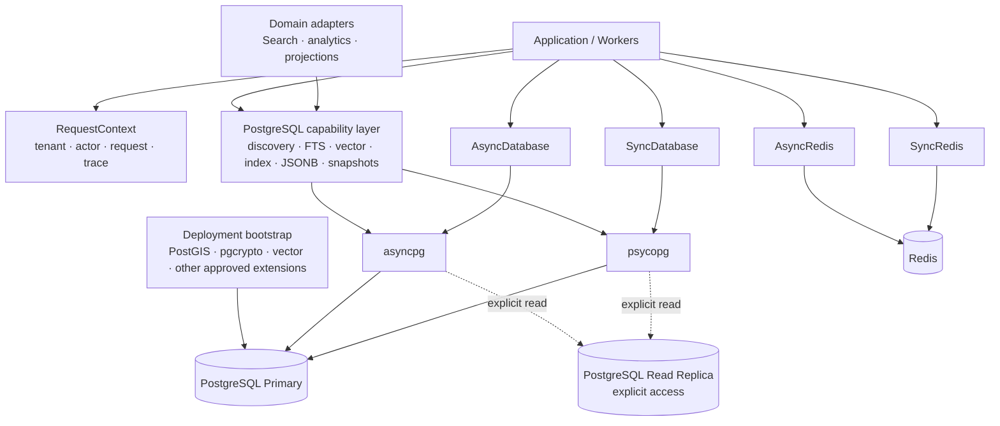
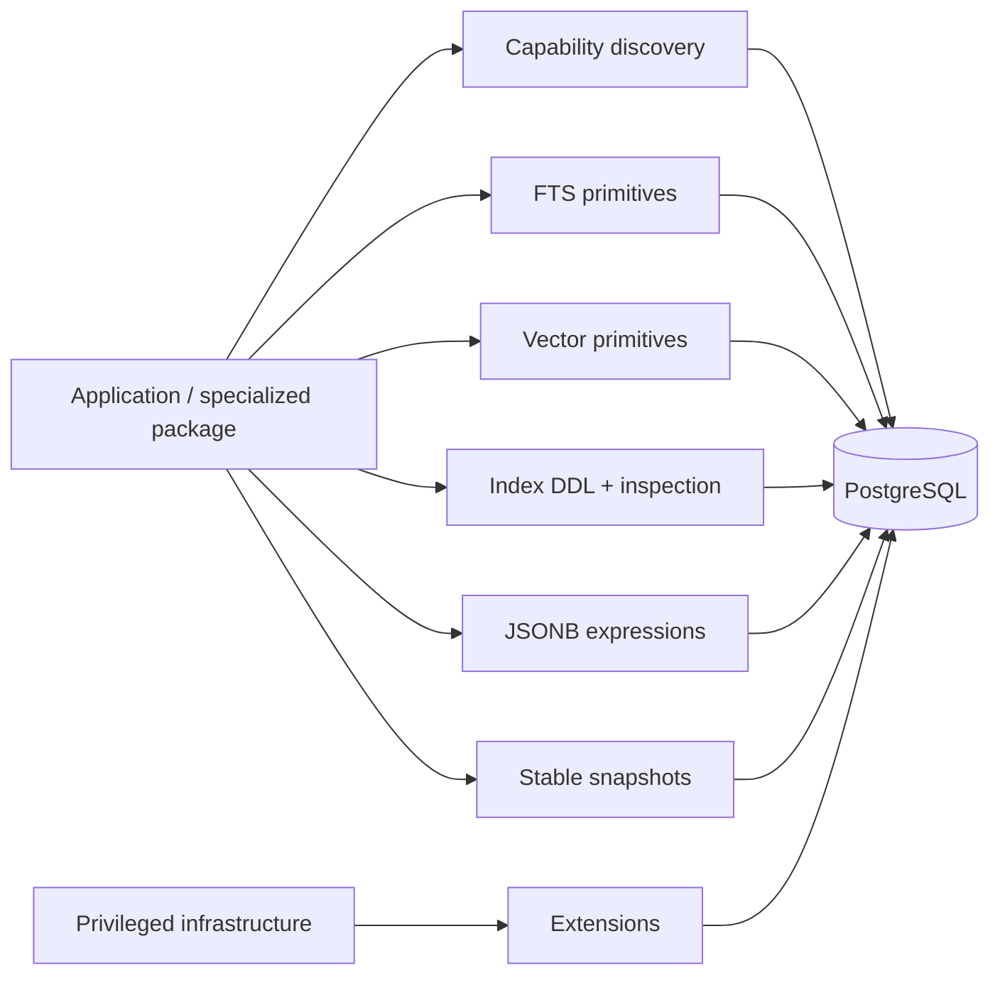
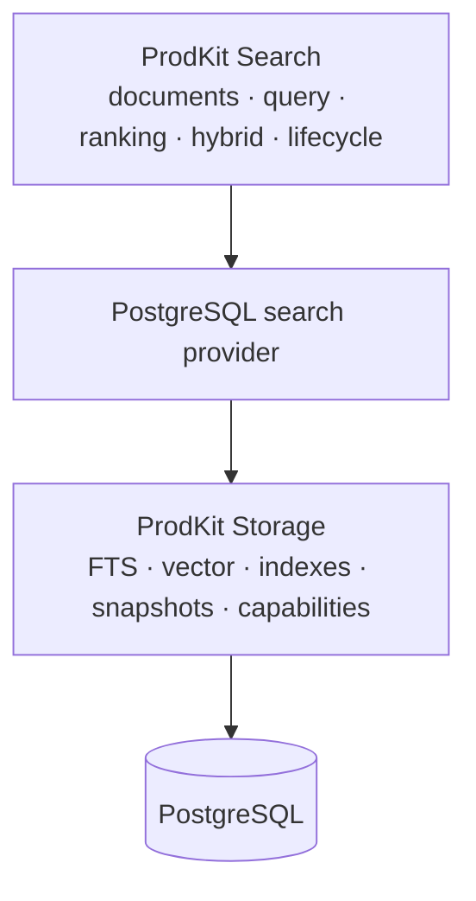

# Architecture

## Principles

1. **PostgreSQL is the system of record.** Redis accelerates, coordinates, and buffers; it does not own authoritative SaaS business state.
2. **Transactions are explicit.** Session creation, transaction begin, commit, rollback, and disposal are visible in application code.
3. **Sync and async have equal capabilities.** Both runtimes use the same metadata, models, migration history, context, and operational semantics.
4. **Replica use is explicit.** Callers select a read session or read-only transaction. A normal transaction always uses the primary.
5. **Tenant isolation is defense in depth.** Application filters are useful, but PostgreSQL RLS can enforce the boundary at the database layer.
6. **Cross-system delivery is at least once.** Domain writes and outbox enqueue are atomic; external publication must be idempotent.
7. **No hidden global clients.** Runtime objects own connection pools and provide deterministic shutdown.
8. **Storage owns database mechanics, not domain semantics.** Reusable PostgreSQL capability/type/index/snapshot primitives belong here; search ranking, embeddings, hybrid retrieval, and product-specific projections do not.
9. **Privileged extensions are deployment-owned.** Runtime code and ordinary migrations inspect required capabilities but never silently install or upgrade PostgreSQL extensions.

## Components



The capability layer is not a second search engine abstraction. It exposes PostgreSQL-native mechanisms that higher-level packages can compose without duplicating storage plumbing.

## Database runtime

Each runtime creates:

- one primary engine;
- an optional replica engine;
- a write session factory;
- a read session factory.

The pool is bounded by `pool_size + max_overflow`. Size every process independently. For example, 12 web processes with a pool of 10 and overflow of 20 can create up to 360 connections before workers, migrations, observability, or administrative clients are counted.

## Transaction semantics

- `session()` only owns lifecycle; it does not commit automatically.
- `transaction()` begins and commits on success and rolls back on failure.
- `read_transaction()` sets the transaction to read-only.
- `SyncUnitOfWork` and `AsyncUnitOfWork` require an explicit `commit`; leaving without one rolls back.
- Serialization/deadlock retries rerun the complete callback in a fresh transaction. Therefore the callback must not perform non-idempotent external side effects.

## Read replicas

Automatic ORM routing can split a logical operation across different database states. This package requires explicit replica selection. Use a primary transaction when:

- a read depends on a write from the same request;
- row locks are required;
- the query drives a decision that must observe current authoritative state;
- replica lag is unknown or unacceptable.

Use replicas for stale-tolerant dashboards, exports, analytics-like reads, search projections, and background scans.

A repeatable-read snapshot is distinct from replica selection. The caller chooses the engine first and then enters the explicit snapshot context when reconciliation or inspection must observe one stable committed database state throughout a scan.

## PostgreSQL capability layer

The v0.4.0 capability layer contains six mechanical groups:



### Capability discovery

Sync and async inspection read server version, extension availability/installation, access methods, and text-search configurations. `require_postgresql_capabilities` and the CLI convert missing prerequisites into fail-closed deployment/readiness errors. Inspection is read-only and never repairs production schema.

### Native full-text primitives

Storage exposes low-level `tsvector`/`tsquery` expressions and GIN index migration support. The consumer owns language configuration, generated projection expressions, field weighting, query syntax, ranking, highlighting, and result semantics.

### Vector primitives

The optional `vector` extra exposes pgvector SQLAlchemy types and supported distance/operator-class mappings. HNSW and IVFFlat migration helpers remain schema mechanics. Embedding generation, model selection, vector normalization, candidate generation, relevance fusion, reranking, and recall targets belong to higher-level systems.

### Index lifecycle

Advanced concurrent-index DDL supports PostgreSQL access methods, operator classes, storage parameters, predicates, and included columns. Index inspection reports validity/readiness and canonical definitions for deployment checks and reconciliation.

Concurrent index creation crosses Alembic transaction boundaries through an explicit autocommit block; consumers should isolate heavyweight builds into deliberate migration revisions and measure lock, WAL, disk, memory, build-time, and query-plan effects on production-shaped data.

### JSONB and snapshots

JSONB helpers are expression building blocks, not a public query language. Repeatable-read contexts provide stable read-only or read/write snapshots without hiding engine choice or retry semantics.

## Boundary with ProdKit Search

A PostgreSQL-backed search provider can depend on these low-level primitives while keeping search behavior in ProdKit Search:



Storage must not grow embeddings, analyzers as product concepts, ranking policy, fusion strategy, suggestions, highlighting, query interpretation, search pagination contracts, or search-index generation semantics merely because PostgreSQL can execute them.

## Optimistic and pessimistic concurrency

`OptimisticLockMixin` enables SQLAlchemy version checking. Use it for normal concurrent edits where conflicts should fail rather than block.

Use `SELECT ... FOR UPDATE` for short critical sections involving an existing row. Use transaction-scoped advisory locks for resources that are not naturally represented by one lockable row, such as `tenant + billing_period`.

Keep locks in a deterministic order and transactions short.

## Outbox delivery

The outbox state machine is:

```text
pending → processing → published
             │
             ├── retry → pending
             └── exhausted → dead
```

Claims use `FOR UPDATE SKIP LOCKED`, allowing parallel workers. Processing leases can be reclaimed after a stale interval. Publication remains at least once; consumers or brokers should deduplicate using the outbox event ID.

## Audit log

The audit table is append-only by convention. A production database role should receive `INSERT` and `SELECT` as needed but not `UPDATE` or `DELETE`. High-volume or compliance-heavy systems should partition it by time and export immutable copies to retention-controlled object storage.

## PostGIS

Use `geometry` when planar operations in a known projection are appropriate. Use geography casts for accurate Earth-distance queries in meters. Spatial indexes support candidate filtering, but query plans must still be verified with `EXPLAIN (ANALYZE, BUFFERS)` on production-shaped data.

PostGIS follows the same extension rule as pgvector: infrastructure provisions and upgrades it; Storage checks and consumes it.

## Redis responsibility separation

Different Redis workloads have conflicting requirements:

| Workload | Typical eviction | Durability |
|---|---|---|
| Cache | `allkeys-lfu` or `allkeys-lru` | Optional |
| Locks | `noeviction` | Low latency; fail closed when unavailable |
| Idempotency | `noeviction` | AOF/replication recommended |
| Rate limits | `noeviction` or carefully bounded | Usually ephemeral |
| Streams | `noeviction` | AOF/replication and trimming policy |

At scale, run these on separate logical or physical deployments rather than relying only on key prefixes.

## Release architecture

Normal pull requests are validated by the permanent `test` and `security` jobs. A release is promoted only from a `release/vX.Y.Z` branch that resolves exactly to current `main` and matches the version in `pyproject.toml`.

The permanent release workflow revalidates locked source, static typing/tests, builds the wheel and sdist, creates an exact-source archive and `SHA256SUMS`, uploads through a draft-first publisher, and verifies remote asset size/digest plus tag target before publication. Successful promotion deletes the temporary release branch; the published version tag is immutable.

See [`postgresql-capabilities.md`](postgresql-capabilities.md), [`operations.md`](operations.md), [`../VALIDATION.md`](../VALIDATION.md), and [`../ROADMAP.md`](../ROADMAP.md).
