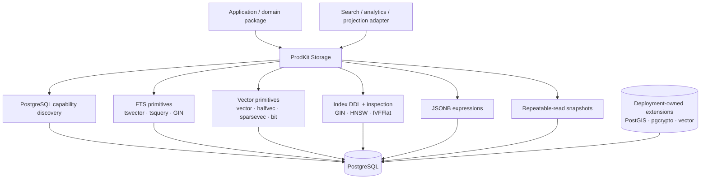

# PostgreSQL capability primitives

ProdKit Storage owns reusable PostgreSQL capabilities and migration/runtime primitives. It does **not** own search-domain behavior such as query interpretation, ranking, hybrid fusion, embeddings, reranking, suggestions, or search index lifecycle. Those belong in consuming packages such as ProdKit Search.

## Capability boundary



## Extension lifecycle

Database extensions are infrastructure-owned. Runtime code and ordinary Alembic revisions must not silently execute privileged `CREATE EXTENSION` or `ALTER EXTENSION` statements.

Use capability discovery to verify that a deployment already provides required extensions:

```python
from prodkit_storage.database import inspect_postgresql_capabilities_sync

with database.write_engine.connect() as connection:
    capabilities = inspect_postgresql_capabilities_sync(connection)

if not capabilities.has_extension("vector"):
    raise RuntimeError("deployment must provision pgvector before startup")
```

The same rule applies to PostGIS and other privileged extensions. Local development and CI bootstrap may provision them explicitly because those environments own their database lifecycle.

## Full-text search primitives

PostgreSQL provides native `tsvector` and `tsquery` types. Storage exposes SQLAlchemy expression helpers and GIN index migration helpers so a domain adapter can build its own search projection without duplicating low-level PostgreSQL plumbing.

Storage does not choose language analyzers, field weights, ranking functions, query syntax, result highlighting, or pagination semantics for callers. Those decisions remain application/domain responsibilities.

A generated/materialized `tsvector` column is normally preferable when a workload repeatedly searches the same projection. The application owns the generated expression because it knows which fields and language configuration are authoritative.

## Vector primitives

The optional `vector` extra integrates the official `pgvector` Python package for SQLAlchemy types:

```bash
uv add 'prodkit-storage[vector]'
```

Consumers can request `vector`, `halfvec`, `sparsevec`, and bit-vector SQLAlchemy types through Storage without importing pgvector directly. The PostgreSQL `vector` extension itself must still be installed by deployment infrastructure.

Vector index helpers support the operator-class combinations exposed by pgvector and fail closed on unsupported combinations. HNSW and IVFFlat tuning remains workload-specific; do not copy example values into production without recall/latency/build-cost measurements on production-shaped data.

## Index lifecycle

`create_index_concurrently` supports PostgreSQL access methods, operator classes, storage parameters, partial predicates, and included columns while preserving Alembic's required autocommit boundary.

Dedicated helpers cover common GIN and vector-index cases. Concurrent index creation should normally live in a dedicated migration revision because entering Alembic's `autocommit_block()` commits the transaction that precedes it.

Index inspection exposes schema/table/name, access method, validity/readiness, uniqueness, predicate, and PostgreSQL's canonical index definition. This is intended for deployment checks and reconciliation, not for automatically mutating production schema at runtime.

## Stable inspection snapshots

Reconciliation and projection inspection often need a database snapshot that cannot observe different committed states halfway through a scan. Storage therefore exposes sync and async repeatable-read connection contexts.

They create an explicit `REPEATABLE READ` transaction and can additionally enforce `READ ONLY`. They do not retry serialization failures automatically and they do not hide replica selection; the caller chooses the engine intentionally.

## JSONB

Small SQLAlchemy helpers expose text-path extraction and scalar/array normalization building blocks. They are intentionally mechanical. Domain filtering, sorting, authorization, and search semantics stay in the consuming package.

## Production acceptance

A reusable library can prove that its SQL compiles and behaves against supported PostgreSQL/pgvector versions, but each deployment must still validate:

- extension availability and approved extension versions;
- index build duration, WAL, disk, memory, and lock behavior;
- ANN recall/latency under production-shaped data and filters;
- query plans with `EXPLAIN (ANALYZE, BUFFERS)`;
- migration sequencing and rollback/roll-forward procedures;
- backup/PITR, HA/failover, and capacity requirements.
